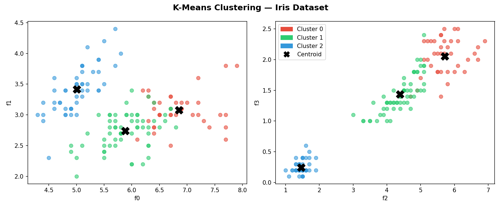
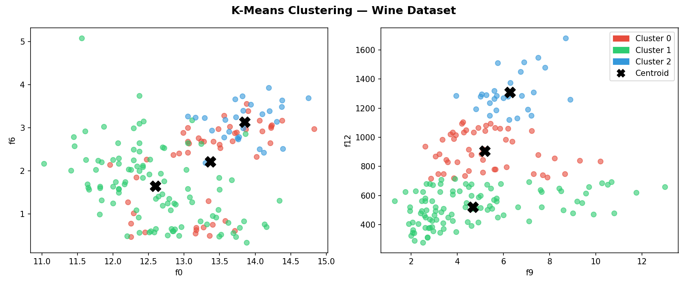

# KMeans (C++)

A from-scratch K-Means clustering implementation in C++17 with no external dependencies. The algorithm is dataset-agnostic — it operates on any number of features. Ships with two demos (Iris and Wine datasets), a scaling benchmark, and a generic Python plotting script.

## Quickstart

### C++ (build and run)

```bash
git clone https://github.com/RayverAimar/k-means-cpp.git
cd k-means-cpp
make            # builds ./kmeans and ./benchmark
./kmeans        # Iris + Wine demo → exports CSV files
./benchmark     # scaling table → exports benchmark.csv
```

Requires a C++17-capable compiler (`g++` or `clang++`). No external C++ libraries needed.

### Python (visualize)

```bash
python3 -m venv .venv
source .venv/bin/activate      # Windows: .venv\Scripts\activate
pip install -r requirements.txt

# Iris — default features (f0 vs f1, f2 vs f3)
python plot.py iris_results.csv iris_centroids.csv clusters_iris.png

# Wine — pick informative feature pairs (Alcohol/Flavanoids, Color intensity/Proline)
python plot.py wine_results.csv wine_centroids.csv clusters_wine.png 0 6 9 12

# Benchmark scaling chart
python plot_benchmark.py
```

Run `./kmeans` and `./benchmark` first — the Python scripts read the CSVs they export.

## Iris demo

150 samples · 4 features · K=3 · converges in 11 iterations



## Wine demo

178 samples · 13 features · K=3 · converges in 12 iterations · from the [UCI ML Repository](https://archive.ics.uci.edu/ml/machine-learning-databases/wine/)



## Benchmark

`./benchmark` generates synthetic 4D Gaussian clusters and measures wall-clock time (Apple M-series, `-O2`):

```
N           K     Iters     Converged Time (ms)
----------------------------------------------------
10000       3     21        yes       5.84
100000      3     100       no        305.21
1000000     3     100       no        2346.25

10000       10    22        yes       16.39
100000      10    100       no        710.22
1000000     10    100       no        7108.41
```


Non-convergence at large N is expected — naive initialization (first K points as centroids) struggles at scale. k-means++ initialization would converge faster and more reliably.

## How it works

1. **Initialize** — use the first K points in the dataset as initial centroids
2. **Assign** — assign each point to the nearest centroid (Euclidean distance over all features)
3. **Update** — move each centroid to the mean of its assigned points
4. **Repeat** until convergence (`tol=1e-6`) or `max_iters`

Time complexity per iteration: `O(N × K × D)` where D is the number of features. Total: `O(N × K × D × iters)`.

## Plotting

`plot.py` is dataset-agnostic — it reads any CSV exported by `./kmeans` and plots two feature-pair views side by side:

```
python plot.py <results.csv> <centroids.csv> [out.png] [xi] [yi] [xj] [yj]
```

Feature indices `xi yi xj yj` default to `0 1 2 3`. For datasets with many features, pick the most discriminating pair manually.

## File structure

```
src/
  point.h           — Point struct (n-dimensional, Euclidean distance)
  kmeans.h/cpp      — algorithm, returns {centroids, iterations, converged}
  main.cpp          — Iris + Wine demo with timing and CSV export
  benchmark.cpp     — synthetic data generator + timing table + CSV export
dataset/
  iris.data         — UCI Iris dataset (150 samples, 4 features)
  wine.data         — UCI Wine dataset (178 samples, 13 features)
plot.py             — generic cluster scatter plot (any dataset)
plot_benchmark.py   — N vs time scaling chart
requirements.txt    — matplotlib
Makefile
```

## Parameters

| Parameter    | Default | Description                               |
|--------------|---------|-------------------------------------------|
| `k`          | `3`     | Number of clusters                        |
| `max_iters`  | `300`   | Maximum iterations (benchmark uses `100`) |
| `KMEANS_TOL` | `1e-6`  | Convergence threshold (centroid movement) |

Modify these in `src/kmeans.h` and `src/benchmark.cpp`.

## Note

Educational implementation. For production use, prefer well-tested libraries like [dlib](http://dlib.net/) or [mlpack](https://www.mlpack.org/) which offer k-means++ initialization, BLAS-accelerated distance computations, and parallelism.
