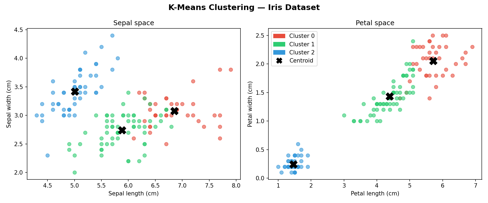
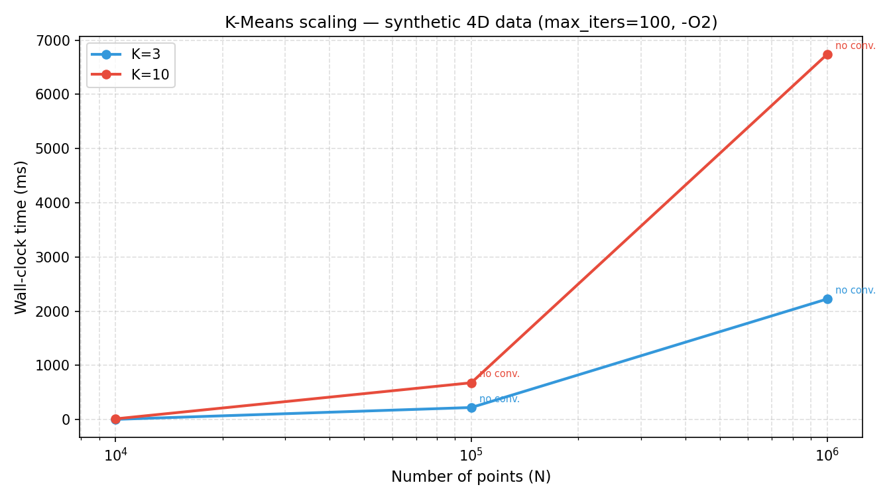

# KMeans (C++)

A from-scratch K-Means clustering implementation in C++17 with no external dependencies. Ships with two executables — a demo that clusters the [Iris dataset](https://archive.ics.uci.edu/ml/machine-learning-databases/iris/) and a benchmark that measures wall-clock time on synthetic data up to 1 million points — plus Python scripts for visualization.

## Quickstart

### C++ (build and run)

```bash
git clone https://github.com/RayverAimar/k-means-cpp.git
cd k-means-cpp
make            # builds ./kmeans and ./benchmark
./kmeans        # Iris demo → exports results.csv + centroids.csv
./benchmark     # timing table → exports benchmark.csv
```

Requires a C++17-capable compiler (`g++` or `clang++`). No external C++ libraries needed.

### Python (visualize)

```bash
python3 -m venv .venv
source .venv/bin/activate      # Windows: .venv\Scripts\activate
pip install -r requirements.txt

python plot.py            # reads results.csv → saves clusters.png
python plot_benchmark.py  # reads benchmark.csv → saves benchmark.png
```

Run `./kmeans` and `./benchmark` first — the Python scripts read the CSVs they export.

## Demo

`./kmeans` clusters 150 Iris samples into 3 groups, reports convergence stats, and exports CSVs:

```
CENTROID [0]: (6.85384, 3.07692) (5.71538, 2.05385)
CENTROID [1]: (5.88361, 2.74098) (4.38853, 1.43443)
CENTROID [2]: (5.006, 3.418) (1.464, 0.244)

Converged: yes  |  Iterations: 11  |  Time: 54 us
Exported results.csv and centroids.csv — run `python plot.py` to visualize.
```

`plot.py` produces a side-by-side scatter of the sepal and petal feature spaces, colored by cluster with centroids marked:



## Benchmark

`./benchmark` generates synthetic 4D Gaussian clusters and measures wall-clock time (Apple M-series, `-O2`):

```
N           K     Iters     Converged Time (ms)
----------------------------------------------------
10000       3     21        yes       5.84
100000      3     100       no        305.21
1000000     3     100       no        2346.25

10000       10    22        yes       16.39
100000      10    100       no        710.22
1000000     10    100       no        7108.41
```

`plot_benchmark.py` produces a log-scale N vs time plot with one line per K value:



Non-convergence at large N is expected — naive initialization (first K points as centroids) struggles at scale. k-means++ initialization would converge faster and more reliably.

## How it works

1. **Initialize** — use the first K points in the dataset as initial centroids
2. **Assign** — assign each point to the nearest centroid (Euclidean distance over all 4 features)
3. **Update** — move each centroid to the mean of its assigned points
4. **Repeat** until convergence (`tol=1e-6`) or `max_iters`

Time complexity per iteration: `O(N × K)`. Total: `O(N × K × iters)`.

## File structure

```
src/
  point.h           — Point struct (4 features, Euclidean distance)
  kmeans.h/cpp      — algorithm implementation, returns {centroids, iterations, converged}
  main.cpp          — Iris demo with timing + CSV export
  benchmark.cpp     — synthetic data generator + timing table + CSV export
dataset/
  iris.data         — UCI Iris dataset (150 samples)
plot.py             — cluster scatter plot (sepal + petal spaces)
plot_benchmark.py   — N vs time scaling plot
requirements.txt    — matplotlib
Makefile
```

## Parameters

| Parameter    | Default | Description                               |
|--------------|---------|-------------------------------------------|
| `k`          | `3`     | Number of clusters                        |
| `max_iters`  | `300`   | Maximum iterations (benchmark uses `100`) |
| `KMEANS_TOL` | `1e-6`  | Convergence threshold (centroid movement) |

Modify these in `src/kmeans.h` and `src/benchmark.cpp`.

## Note

Educational implementation. For production use, prefer well-tested libraries like [dlib](http://dlib.net/) or [mlpack](https://www.mlpack.org/) which offer k-means++ initialization, BLAS-accelerated distance computations, and parallelism.
